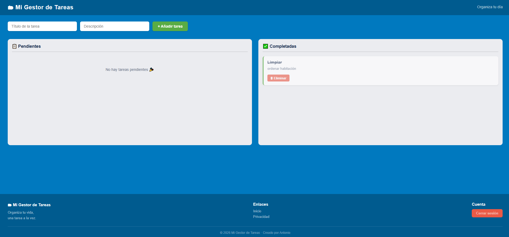

# 🚀 Mi Gestor de Tareas

Aplicación web de gestión de tareas desarrollada con Python y Flask, diseñada para ser segura, eficiente y fácil de usar.

## 📸 Vista Previa

| Inicio de Sesión | Panel de Tareas |
| :---: | :---: |
|  |  |

---

## 🛠️ Tecnologías Utilizadas
* **Backend:** Python + Flask
* **Base de Datos:** SQLite
* **Frontend:** HTML5, CSS3 (Diseño responsivo)
* **Seguridad:** Bcrypt para hashing de contraseñas y Flask-Session.

## 🔒 Seguridad
* **Variables de Entorno:** Las claves sensibles se gestionan mediante archivos `.env`.
* **Protección de Datos:** Las contraseñas nunca se guardan en texto plano.

## 🚀 Cómo ejecutarlo
1. Clona el repositorio.
2. Crea tu entorno virtual: `python -m venv venv`.
3. Instala dependencias: `pip install -r requirements.txt`.
4. Crea un archivo `.env` con tu `SECRET_KEY`.
5. Ejecuta con: `python app.py`.